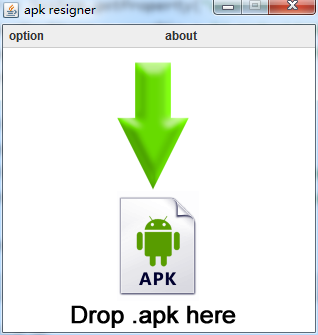
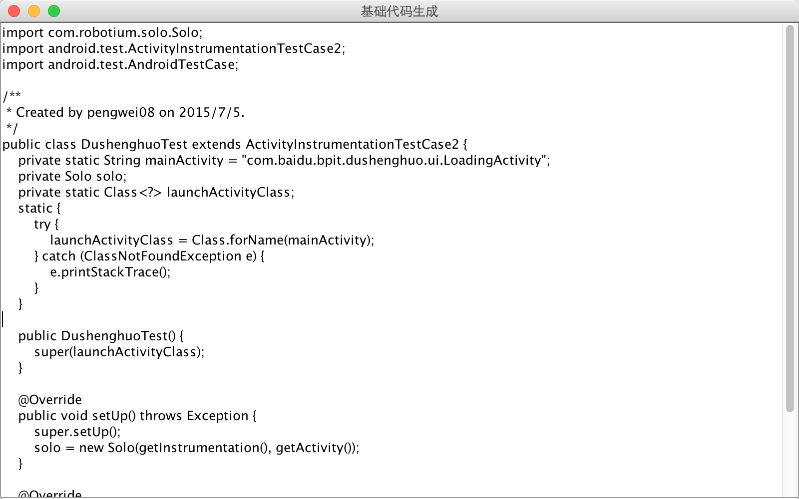
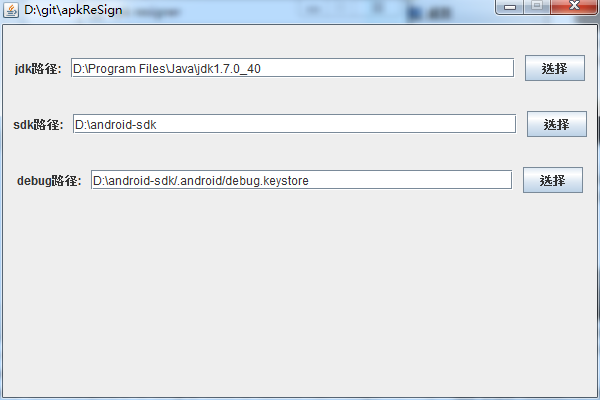

# apkReSign
### 设计初衷
为`robotium `设计的安卓一键重签名工具。<br/>
用过` robotium `的应该都知道` re-sign.jar` 的存在，但是很多人用它却签名失败了。<br/>
` 重签名` 的原理就是去除apk正式签名，使用系统自带的` debug.keystore`默认签名进行再次签名。<br/>
因为`re-sign.jar`默认的` debug.keystore` 在`C盘/用户/.android/debug.keystore`下,<br/>
而后来Android SDK更新后` debug.keystore`存在于`SDK目录/.android/debug.keystore` <br/>
本程序强化了` re-sign.jar`,并加入了`设置路径`和`生成测试代码`的功能。

### 截图
##### 主界面

##### 生成测试代码

##### 设置jdk、sdk、debug.keystore路径


## 用法
download [apkReSign.jar](jar/apkReSign.jar)
#### 用法1
双击apkReSign.jar运行

#### 用法2
在cmd或者命令行下执行以下语句
```
java -jar apkReSign.jar的路径
```
签名成功后输出的文件名为原apk文件名+debug.apk,直接在真机或者模拟器上安装即可<br/>

### 导入robotium
#### 下载Jar包
下载[robotium-solo-5.4.1.jar](http://central.maven.org/maven2/com/jayway/android/robotium/robotium-solo/5.4.1/robotium-solo-5.4.1.jar)

#### 利用maven
```xml
<dependencies>
   <dependency>
     <groupId>com.jayway.android.robotium</groupId>
     <artifactId>robotium-solo</artifactId>
     <version>5.4.1</version>
   </dependency>
</dependencies>

```

## 关于
* Blog: [apkfuns.com](http://apkfuns.com?from=github)
* Email: [pengwei1024@gmail.com](http://mail.qq.com/cgi-bin/qm_share?t=qm_mailme&email=pengwei1024@gmail.com)

### 致谢
感谢 [troido/resign](https://github.com/troido/resign)

### License
<pre>
Copyright 2015 Orhan Obut

Licensed under the Apache License, Version 2.0 (the "License");
you may not use this file except in compliance with the License.
You may obtain a copy of the License at

   http://www.apache.org/licenses/LICENSE-2.0

Unless required by applicable law or agreed to in writing, software
distributed under the License is distributed on an "AS IS" BASIS,
WITHOUT WARRANTIES OR CONDITIONS OF ANY KIND, either express or implied.
See the License for the specific language governing permissions and
limitations under the License.
</pre>
